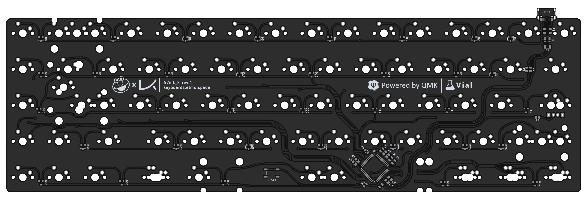
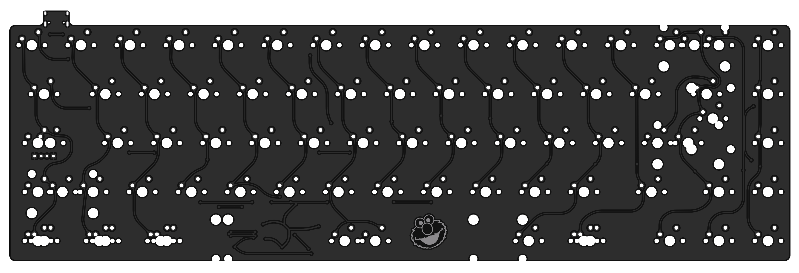

# 67mk_E

[![CC BY-NC-SA 4.0][cc-by-nc-sa-shield]][cc-by-nc-sa]

### A simple "no frills" drop-in replacement PCB for the KBDfans 67mkII / 67lite

---

[KiCAD PCB files](pcb/)

[Gerbers for PCB production](pcb/gerbers/)

[JLCPCB BOM](pcb/fab/67_E_bom_jlc.csv)

[JLCPCB CPL](pcb/fab/67_E_cpl_jlc.csv)

[Vial-QMK firmware](firmware/)

---

---

This work is licensed under a
[Creative Commons Attribution-NonCommercial-ShareAlike 4.0 International License][cc-by-nc-sa].

[![CC BY-NC-SA 4.0][cc-by-nc-sa-image]][cc-by-nc-sa]

[cc-by-nc-sa]: http://creativecommons.org/licenses/by-nc-sa/4.0/
[cc-by-nc-sa-image]: https://licensebuttons.net/l/by-nc-sa/4.0/88x31.png
[cc-by-nc-sa-shield]: https://img.shields.io/badge/License-CC%20BY--NC--SA%204.0-lightgrey.svg
